# csapp 第九章 虚拟内存 读书笔记

## 1. 前言

### 1.1 虚拟内存的是哪个重要能力：
- 1）将主存看成是一个存储在磁盘上的地址空间的高速缓存，在主存中只保存活动区域，并根据需要在磁盘和主存之间来回传送数据，通过这种方式，它高效地使用了主存；
- 2）为每个进程提供了一致的地址空间，从而简化了内存管理；
- 3）保护了每个进程的地址空间不被其他进程破坏
### 1.2 需要理解虚拟内存的原因：
- 1）虚拟内存是核心的，可以帮助理解系统的工作方式
- 2）虚拟内存是强大的，可以帮助利用其强大的功能在应用程序中添加动力
- 3）虚拟内存是危险的，可以帮忙避免段错误等问题
### 1.3 本章结构：
- 从两个角度描述：1）虚拟内存工作方式；2）应用系统如何使用和管理虚拟内存

## 2. 内容：
### 9.1 物理和虚拟寻址
#### 物理寻址: 
- 计算机系统的主存被组织成一个由M个连续的字节大小的单元组成的数组，每个字节都有唯一的物理地址（Physical Address， PA），第一个地址为0，最后一个地址为M-1。cpu执行加载指令时，直接生成一个有效的物理地址，通过内存总线，传递给主存，主存取出物理地址对应开始的字节，将其返回给CPU，保存在寄存器中，如下图：
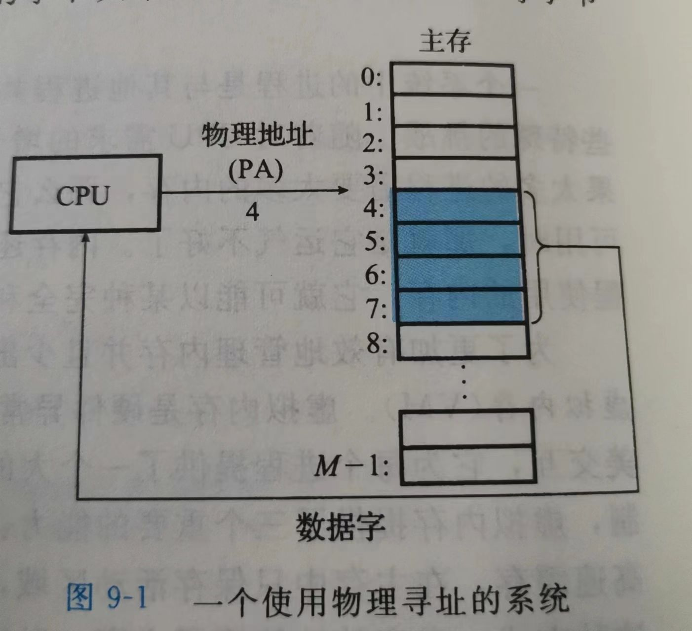

#### 虚拟寻址：
- CPU通过生成一个虚拟地址（Virtual Address， VA）来访问主存，这个虚拟地址在被送到内存之前先转换成适当的物理地址。将一个虚拟地址转换为物理地址的任务叫做地址翻译（address translation）。这一过程需要CPU硬件和操作系统的合作，CPU芯片上叫做内存够管理单元（memory Management Unit， MMU），利用操作系统管理的存放在主存中的查询表来动态翻译虚拟地址，如下图：
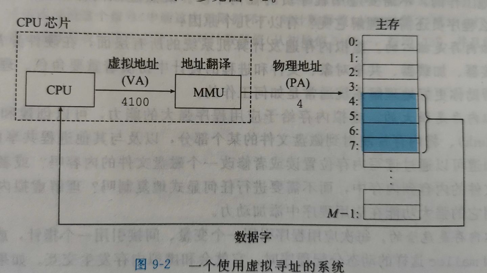

### 9.2 地址空间
- 地址空间（address space）是一个非负整数地址的有序集合，如果地址空间中的整数是连续的，则称为线性地址空间（linear address space）。在一个带虚拟内存的系统，CPU从一个有N=2^n个地址的地址空间中生成虚拟地址，这个地址空间称为虚拟地址空间（virtual address space）。
- 一个地址空间的大小由表示最大地址所需要的位数来描述。
### 9.3 虚拟内存作为缓存的工具
- 概念上，虚拟内存被组织为一个由存放在磁盘上的N个连续的字节大小的单元组成的数组，每字节都有一个唯一的虚拟地址，作为倒数组的索引。磁盘上的数组的内容被缓存在主存中。和其他缓存一样，磁盘（较低层级）上的数据被分割成块，这些块作为磁盘和主存（较高层级）之间的传输单元。VM系统通过将将虚拟内存分割为称为虚拟页（Virtual Page， VP）的大小固定的块来处理这个问题。每个虚拟页的大小为P=2^p字节。类似的，物理内存被分割成物理页（Physical Page， PP），大小为P字节（物理页也被称为页帧，page frame）。
- 任意时刻， 虚拟页面的集合分成3个不相交的子集：
    - 未分配的：VM还没未分配（或者创建）的页
    - 缓存的：已缓存在物理内存中的已分配页
    - 未缓存的：未缓存在物理内存中的已分配页
- 如下图，8个虚拟页的VM，VP0、VP3未分配，VP1、VP4、VP6分配并缓存在物理内存中，VP2、VP5、VP7被分配了，但是没有缓存在物理内存中：
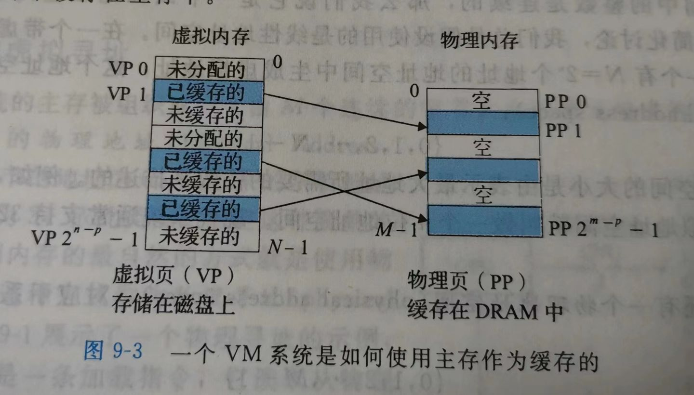

#### 9.3.1 DRAM缓存的组织结构
- DRAM（虚拟内存系统的缓存，在主存中缓存虚拟页）比SRAM（位于CPU和主存之间的L1、L2和L3高速缓存）慢大约10倍，磁盘比DRAM慢大约100000倍，因此DRAM缓存不命中代价很大。
原因：1）DRAM缓存不命中由磁盘来服务，SRAM缓存不命中由DRAM的主存来服务；2）从磁盘的一个扇区读取第一个字节的时间开销，要比读这个扇区内的连续字节要慢100,000倍，所以虚拟页一般很大，4kb~2MB。
#### 9.3.2 页表
- VM需要确定一个虚拟页是否缓存在DRAM中的某个地方：
    - 1）如果是，进一步确认这个虚拟页存放在哪个物理页中；
    - 2）如果不是，判断这个虚拟页存放在磁盘的哪个位置，在物理内存中选择一个牺牲页，并将虚拟页从磁盘复制到DRAM中，替换这个牺牲页。
- 功能有:
    - 1）操作系统软件、MMU（内存管理单元）中的地址翻译硬件、存放在物理内存中叫做页表（page table）的数据结构，页表将虚拟页映射到物理页
    - 2）每次地址翻译硬件将一个虚拟地址转换成物理地址时，都会读取页表。操作系统负责维护页表以及传送页。
- 如下图，8个虚拟页，4个物理页的系统的页表。页表就是页表条目（Page Table Entry， PTE）的数组，假设其由一个有效位（valid bit，表明该虚拟页是否被缓存在DRAM中）和一个n位地址字段组成

- 任何物理页都可以包含任何虚拟页

#### 9.3.3 页命中


#### 9.3.4 缺页
- DRAM缓存不命中称为缺页。标志位=0，发现异常，系统调用缺页异常处理程序，牺牲一个页。例子中牺牲VP4
- 触发缺页：
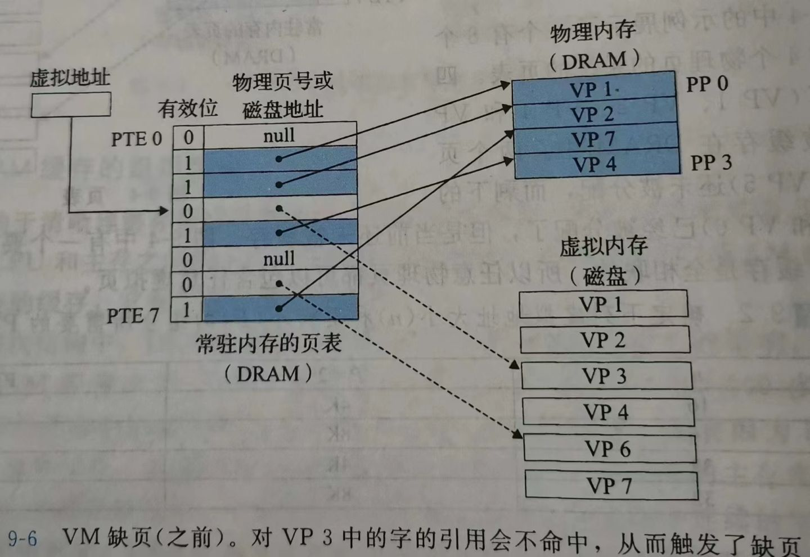
触发缺页：替换


#### 9.3.5 分配页面：
- VP5的分配过程是在磁盘上床架空间，并更新PTE5，使其指向磁盘上这个新创建的页面
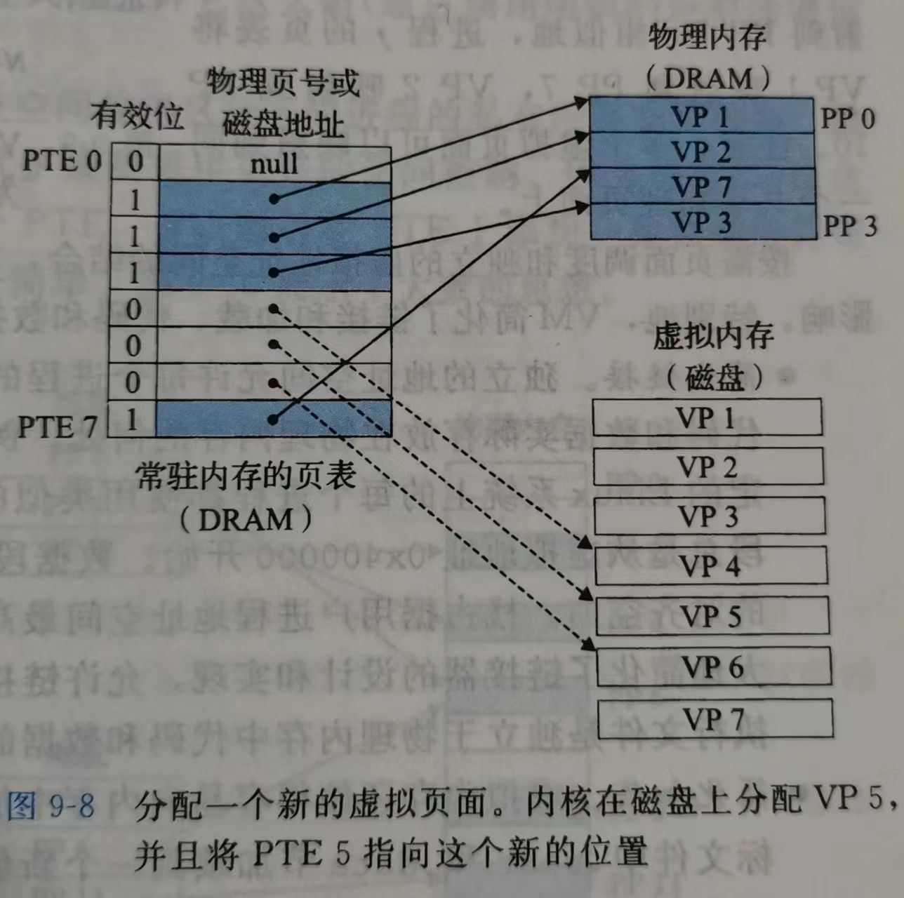

#### 9.4 虚拟内存作为内存管理的工具
- 目前为止，我们假设有一个单独的页表，将一个虚拟地址空间映射到物理地址空间。实际上，操作系统为每个进程提供了一个独立的页表，因为也就是一个独立的虚拟地址空间
- 多个虚拟页面可以映射到同一个共享物理页面上
- 如图：
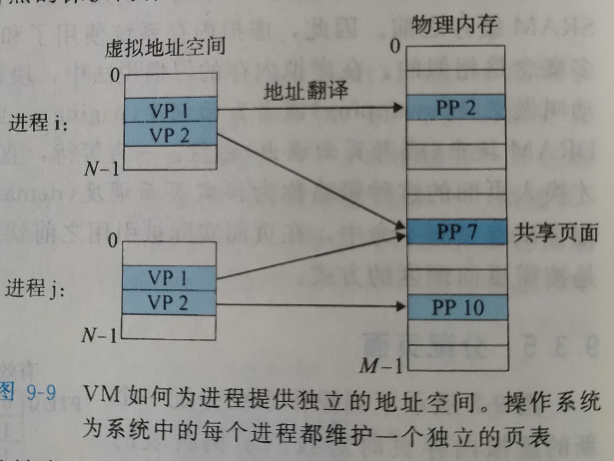


- 好处：
    - 简化连接：独立的地址空间允许每个进程的内存影响使用相同的基本格式，而不管代码和数据实际存放在物理内存的何处
    - 简化加载
    - 简化共享：独立地址空间为操作系统提供了一个管理用户进程和操作系统自身之间共享的一致机制。操作系统通过将不同进程中适当的虚拟页面映射到相同的物理页面，从而安排多个进程共享下共同代码的副本
    - 简化内存分配：虚拟内存为向用户进程提供一个简单的分配额外内存的机制。当一个运行在用户进程中的程序要求额外的堆空间时（如调用malloc），操作系统分配一个适当数字（eg：k）个连续的虚拟内存页面，并且将他们映射到物理内存中任意位置的k个任意的物理页面。
    - 由于页表的工作方式，操作系统没有必要分配k个连续的物理内存页面，页面可以随机地分散在物理内存中。

#### 9.5 虚拟内存作为内存保护的工具
- 虚拟内存通过在PTE上添加一些额外的许可位来控制对一个虚拟页面的访问，如图：


#### 9.6 地址翻译
- 符号小结
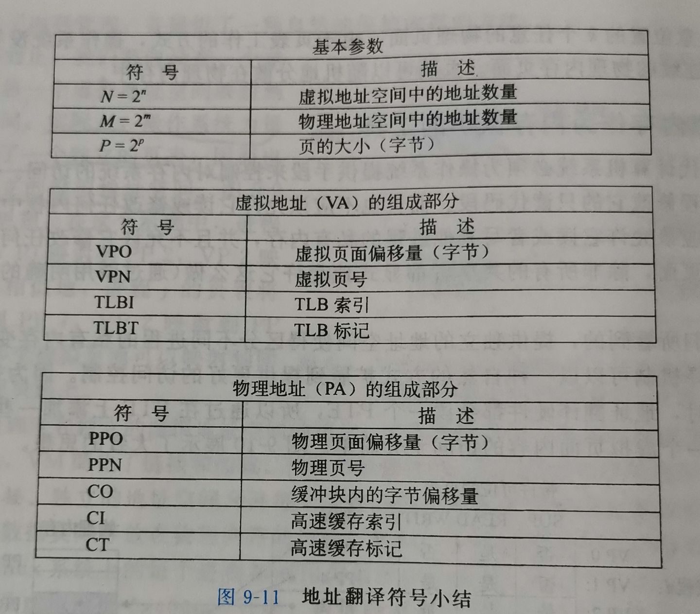

- 使用页表的地址翻译
    - 地址翻译是一个N个元素的虚拟地址空间（VAS）中的元素和一个M元素的物理地址空间（PAS）中的元素之间的映射
    - n位的虚拟地址包含两个部分：一个p位的虚拟页面偏移（Virtual Page Offset，VPO）和一个（n-p）位的虚拟页号（Virtual Page Number）。MMU用VPN来选择适当的PTE。将页表条目中物理页号（Physical Page Number， PPN）截虚拟地址中的VPO串联起来，就得到相应的物理地址
    - 因为物理和虚拟页面都是P字节的，所以物理页面偏移（Physical Page Offset，PPO）是相同的
- 页面命中时CPU硬件执行步骤：
    - step 1：处理器生成一个虚拟地址，并把它传送给MMU
    - step 2：MMU生成PTE地址，并从高速缓存/主存请求得到它
    - step 3：高速缓存/主存向MMU返回PTE
    - step 4：MMU构造物理地址，并把它传送给高速缓存/主存
    - step 5：高速缓存/主存返回所请求的数据字给处理器
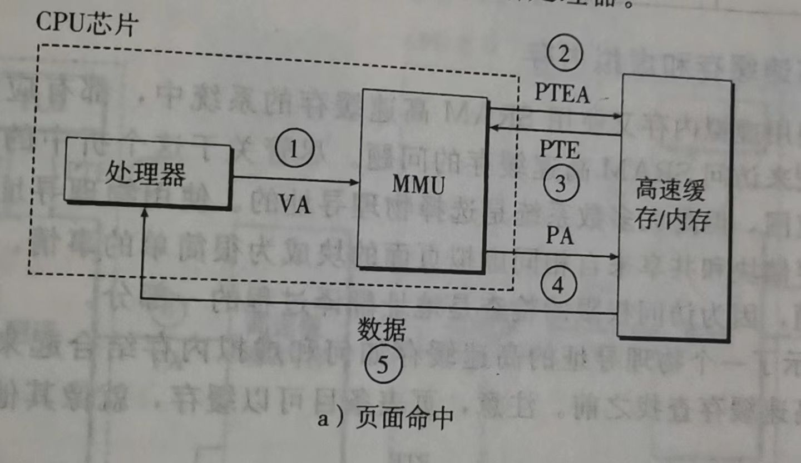

- 缺页时CPU硬件执行步骤：
    - step 1 ~ step 3不变
    - step 4：PTE中的有效位是零，所以MMU触发了一次异常，传递CPU中的控制到操作系统内核中的缺页异常处理程序
    - step 5：缺页处理程序确定出物理内存中的牺牲页，如果这个页面已经被修改了，则把它换出到磁盘
    - step 6：缺页处理程序页面调入新的页面，并更新内存中的PTE
    - step 7：缺页处理程序返回到原来的进程，再次执行导致缺页的指令。CPU将引起缺页的虚拟地址重新发给MMU。因为虚拟页面现在缓存在物理内存中，所以就会命中。


#### 9.6.1 结合高速缓存和虚拟内存
- 主要思路是地址翻译发生在高速缓存查找之前：


#### 9.6.2 利用TLB加速地址翻译
- 为了加速地址翻译，MMU中包括了一个关于PTE的小的缓存，称为翻译后备缓冲器（Translation Lookaside  BUffer，TLB）
- TLB是一个小的，虚拟寻址的缓存，其中每一行都保存着一个由单个PTE组成的块。TLB具有高度相联度。如图所示，用于组选择和行匹配的索引和标记字段是从虚拟地址中的虚拟页号中提取出来的。其中低位表示TLB索引（TLBI），高位表示TLB标记


- TLB的过程: 关键点：所有的地址翻译步骤都是在芯片上的MMU中执行的，因此非常快
    - 步骤（命中）：
        - step 1：CPU产生一个虚拟地址；
        - step 2、step 3：MMU从TLB中取出相应的PTE
        - step 4: MMU将这个虚拟地址翻译成一个物理地址，并且把它发送到高速缓存/主存
        - step 5：高速缓存将所请求的数据字返回给CPU
    - 步骤（不命中）：
        - MMU必须从L1缓存中取出相应的PTE
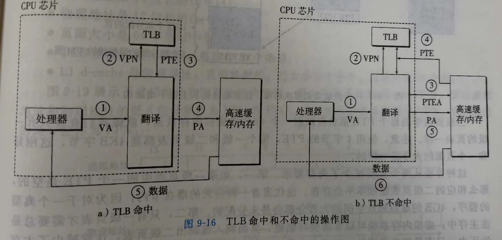

#### 9.6.3 多级页表
- 单独页表比较大，比如一个32位的地址空间，4kb的页面和一个4字节的PTE，需要维护一个4MB的页表。如果是64位，则问题更复杂
- 使用层次结构的页表：压缩页表的常用方法
- 一级页表的每个PTE负责映射虚拟地址空间中的一个4MB的片（chunk），每一片都是由1024个连续的页面组成。假设地址空间为4GB，一个片4MB，则1024个PTE就覆盖所有空间
- 如果片i的每个页面都未被分配，则一级PTEi就是空。如果至少有一个页分配，则就是指向一个2级页表的基址
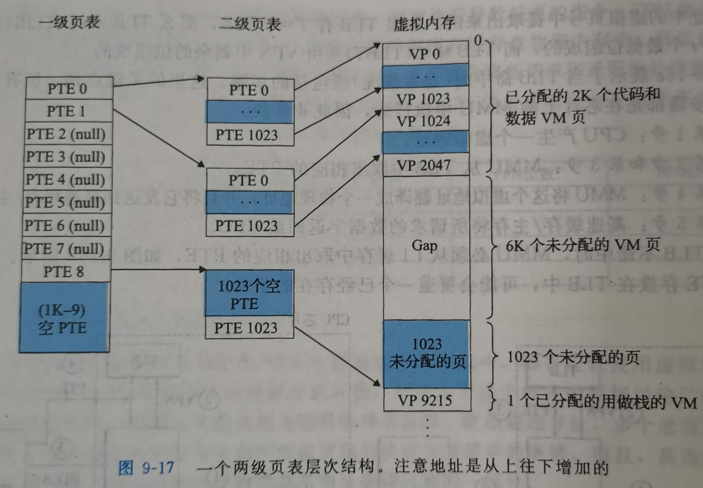
- 好处：
    - 1）如果一级列表的一个PTE是空的，则对应的二级列表不存在，代表着节约
    - 2）只有一级页表才需要总是在主存中，只有最经常使用的页表才需要缓存在主存中，降低了主存的压力
- 多级页表：
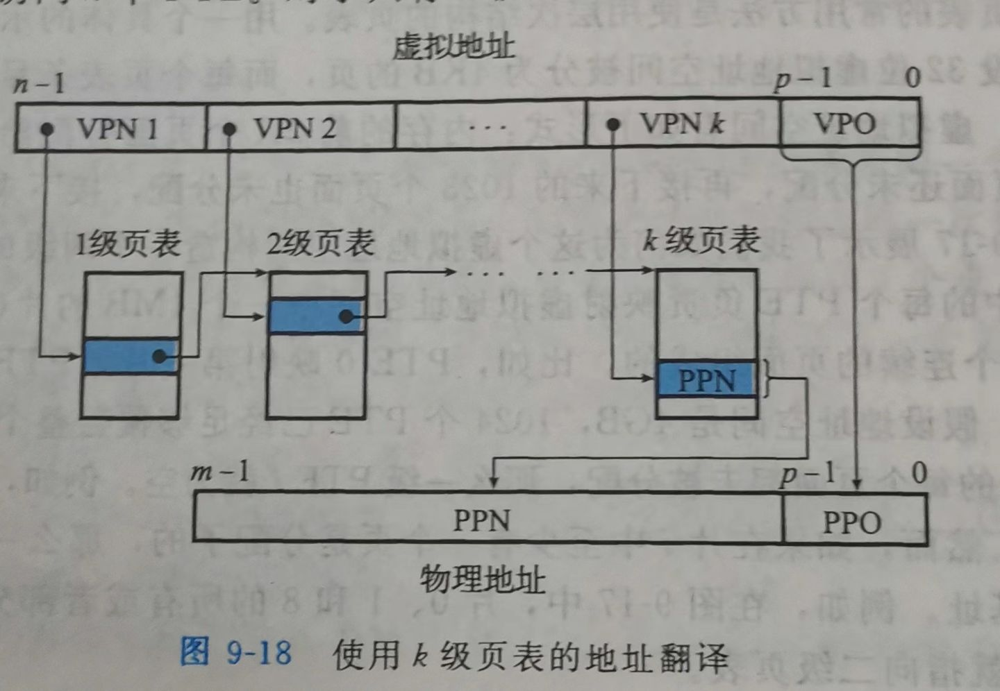

#### 9.6.4 综合：端到端的地址翻译
- 假设：
    - 内存是按字节寻址的
    - 内存访问是针对1字节的自得（不是4字节的字）
    - 虚拟地址是14位长的（n = 14）
    - 物理地址是12位长的（m = 12）
    - 页面大小是64字节（P=64）的
    - TLB是四路组相联的，总共有16个条目
    - L1 d-cace是物理寻址、直接映射的，行大小为4节，二总共有16个组
- 虚拟/物理地址格式：
    - 虚拟地址和物理地址的低6位分别是VPO和PPO
    - 虚拟地址的高8位是VPN，物理地址高6位是PPN
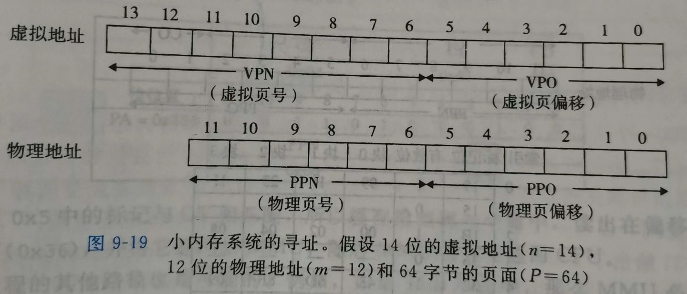

- 小内存系统快照：TLB、页表的一部分、L1 cache
    - TLB：TLB是利用VPN的位进行虚拟寻址的。因为TLB有四个组，所以VPN的低2位就作为组索引（TLBI）。VPN中剩下的高6位作为标记（TLBT），用来区分可能映射到同一个TLB组的不同VPN
    - 页表：
        - 单级设计，一共有2^8=256个页表条目（PTE），但是只对前16个感兴趣
        - 用索引的VPN来标志每一个PTE，但是VPN不是页表的一部分，也不存储在内存中。
        - 每个无效PTE的PPN都用一个破折号来表示，以加强一个概念：无论存储着啥，只要无效，那就没意义
    - 高效缓存：
        - 直接映射的缓存是通过物理地址中的字段来寻址。因为每个块都是4个字节，因此物理地址的低2位作为块偏移（chunk offset，CO）。因为有16组，所以接下来的4位作为组索引（CI），剩下6位作为标记（CT）
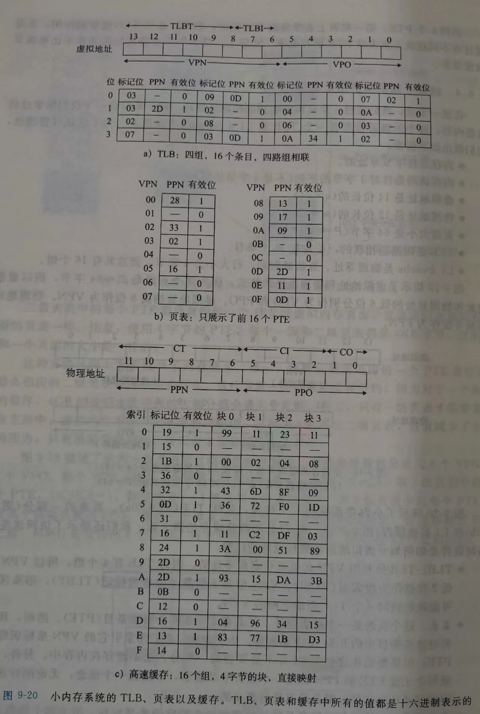

- eg：读取0x3d4处字节的加载指令
    - 写下虚拟地址的各位，标记下来各个字段：


    - 首先MMU从虚拟地址中抽取出VPN（0x0F），并且检查TLB，发现TLBI=TLBT=0x03，所以将索引的3位对应的03标记对应的缓存的PPN：0D 返还给MMU（如果MMU不命中，MMU就需要从主存中取出相应的PTE）
    - 现在，有了PPN（0x0D）,有了VPO（0x14），那么合在一起，物理地址就有了。接下来将物理地址发送给缓存，缓存从物理地址中取出缓存缓存偏移（CO， 0x0），缓存组索引CI（0x5）以及缓存标记CT（0x0D），取出对应位置的数据：36：


    - 索引0x5的缓存标记位是0x0D，和CT匹配，因此缓存命中，读出偏移量CO处的字节（0x36），并将他返回给MMU，随后MMU将它传递回CPU

#### 9.8 内存映射
- 内存映射：Linux通过讲一个虚拟内存区域与一个磁盘上的对象（object）关联起来，以初始化这个虚拟内存区域的内容。虚拟内存区域可以映射到两种类型的对象中的一种：
    - 1）Linux文件系统中的普通文件：一个区域可以映射到一个普通磁盘文件的连续部分，例如一个可执行目标文件。文件区（section）被分成页大小的片，每一片包含一个虚拟页面的初始内容。因为按需进行页面调度，所以这些虚拟页面没有实际交换进入物理内存，直到CPU第一次引用到页面。如果区域比文件区大，那么就用零来填充这个区域的余下部分
    - 2）匿名文件：一个区域也可以映射到一个匿名文件，匿名文件是由内核创建的，包含的全是二进制零。CPU第一次引用这样一个区域内的虚拟页面时，内核就在物理内存中找到一个合适的牺牲页面，如果该页面被修改过，就将这个页面换出来，用二进制零覆盖牺牲页面并更新页表，将这个页面标记为驻留在内存中。注意在磁盘和内存之间并没有实际的数据传送。因为这个原因，映射到匿名文件的区域中的页面有时也叫做请求二进制零的页。
#### 9.8.1 再看共享对象
- 一个对象可以被映射到虚拟内存的一个区域，要么作为共享对象，要么作为私有对象。如果作为共享对象，那么进程对其的任何操作，都会被其他对象可见。私有对象则相反
- 相似的概念：共享区域，私有区域


- 因为每个对象都有一个唯一的文件名，内核可以迅速地判定进程1已经映射了这个对象，而且使进程2中的页表条目指向对应的物理页面。关键点在于即使对象被映射到了多个共享区域，物理内存中也只需要存放共享对象的一个副本。
- 私有对象的写时复制：
    - 一个私有对象开始生命周期的方式基本上与共享对象的一样，在物理内存中只保存私有对象的一份副本。如下图，其中两个进程将一个私有对象映射到它们虚拟内存的不同区域，但是共享这个对象同一个物理副本。对于每个映射私有对象的进程，相应的私有区域的页表条目都被标记为只读，并且区域结构被标记为私有的写时复制。只要没有进程试图写它自己的私有区域，它们就可以继续共享物理内存中对象的一个单独副本。然而，只要有一个进程试图写私有区域内的某个页面，那么这个写操作就会触发一个保护故障：
        - 当故障处理程序注意到保护异常是由于进程试图写私有的写时复制区域中的一个页面而引起的，它就会在物理内存中创建这个页面的一个新副本，更新页表条目指向这个新的副本，然后恢复这个页面的可写权限
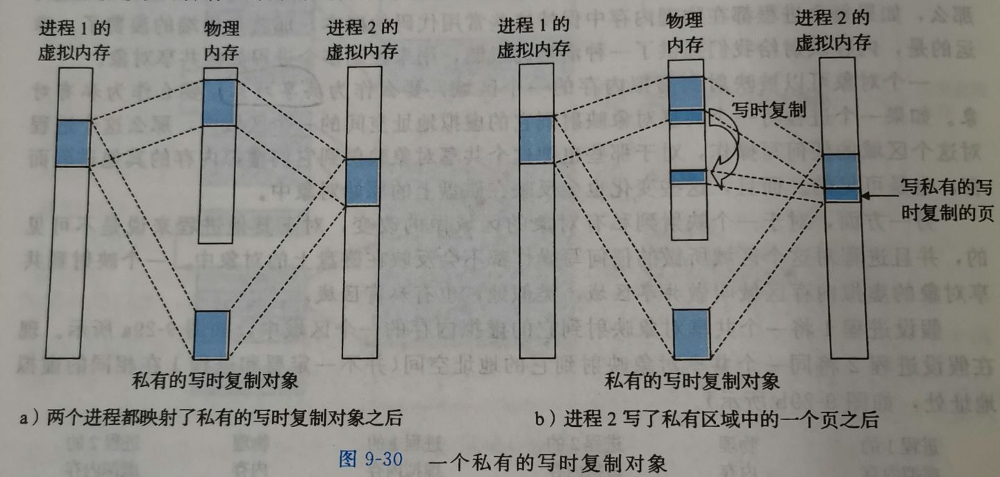

#### 9.8.2 再看fork函数
- 当fork函数被当前进程调用时，内核为新进程创建各种数据结构，并分配给它一个唯一的PID。为了给这个新进程创建虚拟内存，它创建了当前进程的mm_struct\区域结构和页表的原样副本。它将两个进程中的每个页面都标记为只读，并将两个进程中的每个区域结构都标记为私有的写时复制。
- 当fork在新进程中返回时，新进程现在的虚拟内存刚好和调用fork时存在的虚拟内存相同。当这两个进程中的任一个后来进行写操作时，写时复制机制就会创建新页面，因此，也就为每个进程保持了私有地址空间的抽象概念
#### 9.8.3 再看execve函数
- 假设调用了以下函数：
`execve（"a.out", NULL, NULL）;`
- execve函数在当前进程中加载并运行包含在可执行目标文件a.out，包括以下步骤：
    - 删除已存在的用户区域：删除当前进程虚拟地址的用户部分中已存在的区域结构；
    - 映射私有区域：为新程序的代码、数据、bss和栈区域创建新的区域结构。所有这些新的区域都是私有的、写时复制的。代码和数据区被映射为a.out文件中的.text和.data区。bss区域是请求二进制零的，映射到匿名文件，其大小包含在a.out中。栈和堆区域也是请求二进制零的，初始长度为零
    - 映射共享区域：如果a.out程序与共享对象（或目标）链接，比如标准C库libc.so。那么这些对象都是动态链接到这个程序的，然后再映射到用户虚拟地址空间中的共享区域
    - 设置程序计数器（PC）：execve做的最后一点事情就是设置当前进程上下文中程序计数器，使之指向代码区域的入口点。下一次调度这个进程时，它将从这个入口点开始执行，Linux将根据需要换入代码和数据页面
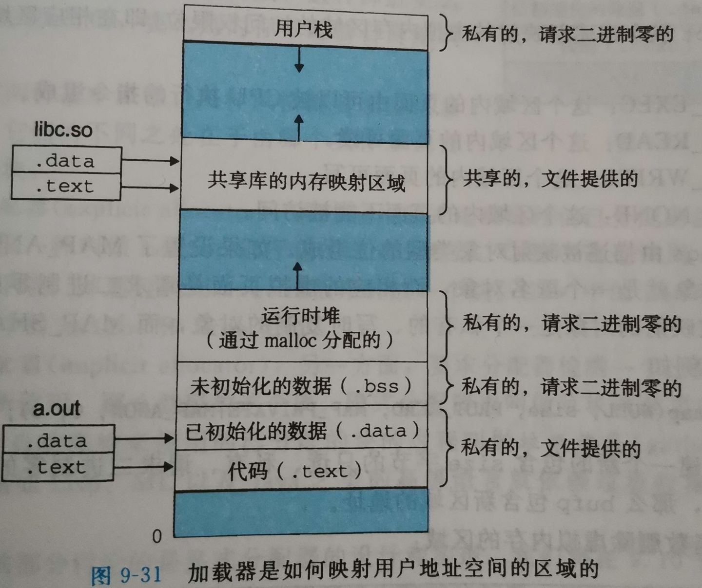

#### 9.8.4 使用mmap函数的用户级内存映射

- Linu进程可以使用mmap函数来创建新的虚拟内存区域，并将对象映射到这些区域。mmap函数要求内核创建一个新的虚拟内存区域，最好是从地址start开始的一个区域，并将文件描述符fd指定的对象的一个连续的片（chunk）映射到这个新的区域。连续的对象片大小为length字节，从距文件开始处偏移量为offset字节的地方开始。start地址仅仅是一个暗示，通常被定义为NULL。
- 参数prot包含描述新映射的虚拟内存区域的访问权限（即在相应区域结构中的vm_prot位）
    - PROT_EXEC：这个区域内的页面可以被CPU执行的指令组成
    - PROT_READ：这个区域内的页面可读
    - PROT_WRITE：这个区域内的页面可写
    - PROT_NONE：这个区域内的页面不能被访问
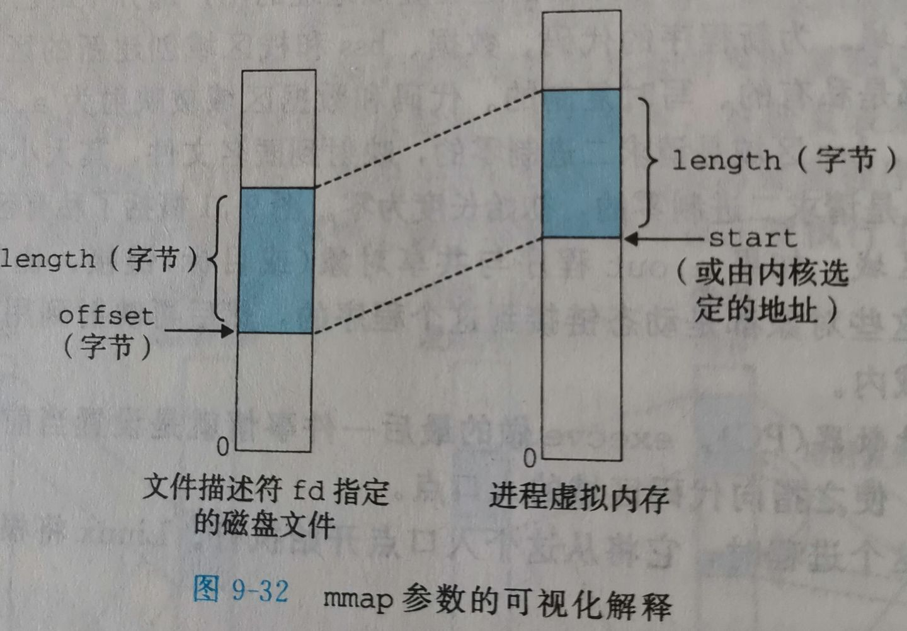

#### 9.9 动态内存分配
- 用动态内存分配器（dynamic meory allocator）更方便，也有更好的可移植性
- 动态内存分配器维护着一个进程的虚拟内存区域，称为堆（heap）：
    - 假设堆是一个请求二进制零的区域，它紧接在未初始化的数据区域后开始，并向上生长（向更高的地址）。对于每个进程，内核维护着一个变量brk（读作“break”），它指向堆的顶部
- 分配器将堆视作一组不同大小的块（block）的集合来维护。每个块就是一个连续的虚拟内存片（chunk），要么是已分配的，要么是空闲的。已分配的块显式地保留为供应程序使用。空闲块可用来分配，空闲块保持空闲，直到它显式地被应用所分配，一个已分配的块保持已分配状态，直到它被释放，这种释放要么是应用程序显式执行的，要么是内存分配器自身隐式执行的
- 分配器由两种基本风格，两种风格都要求应用显式地分配块：
- 显式分配器（explicit allocator）：
    - 要求应用显式地释放任何已分配的块，eg：malloc，new
- 隐式分配器（implicit allocator）：
    - 要求分配器检测一个已分配块何时不再被程序所使用，那么就是释放这个块。隐式分配器也叫作垃圾收集器（garbage collector），而自动释放未使用的已分配块的过程叫做垃圾收集（garbage collection）

#### 9.9.1 malloc和free函数
- malloc函数返回一个指针，指向大小至少为size字节的内存块，这个块会为可能包含在这个块内的任何数据对象类型做对齐。实际中，对齐依赖于变异代码是在32位还是64位。在32位中，malloc返回的块的地址总是8的倍数，在64位中，16的倍数。
- intel将4字节对象称为双字，本节中假设4字节的对象为字，8字节的对象为双字
- 如果malloc遇到问题，则会返回NULL，并设置errno。malloc不初始化它返回的内存
sbrk函数通过将内核的brk指针增加incr来扩展和收缩维度。如果成功，就返回brk的旧值，否则返回-1，并将errno设置为ENOMEM。如果incr为零，那么sbrk返回brk的当前值。用一个负的incr来调用sbrk是合法的，因为返回值（brk的旧值）指向距新堆顶向上abs（incr）字节处。
- free：ptr参数必须指向一个从malloc、calloc或者realloc获得的已分配块的起始位置。如果不是，则free的行为就是未定义的。因为什么都不返回，因此你也不知道出了啥错
- eg：malloc和free的实现是如何管理一个C程序的16字的堆，每个方框代表了一个4字节的字。粗线标出的U型对应于已分配块（有阴影）和空闲块（无阴影），假设分配器返回的块是8字节双字边界对齐
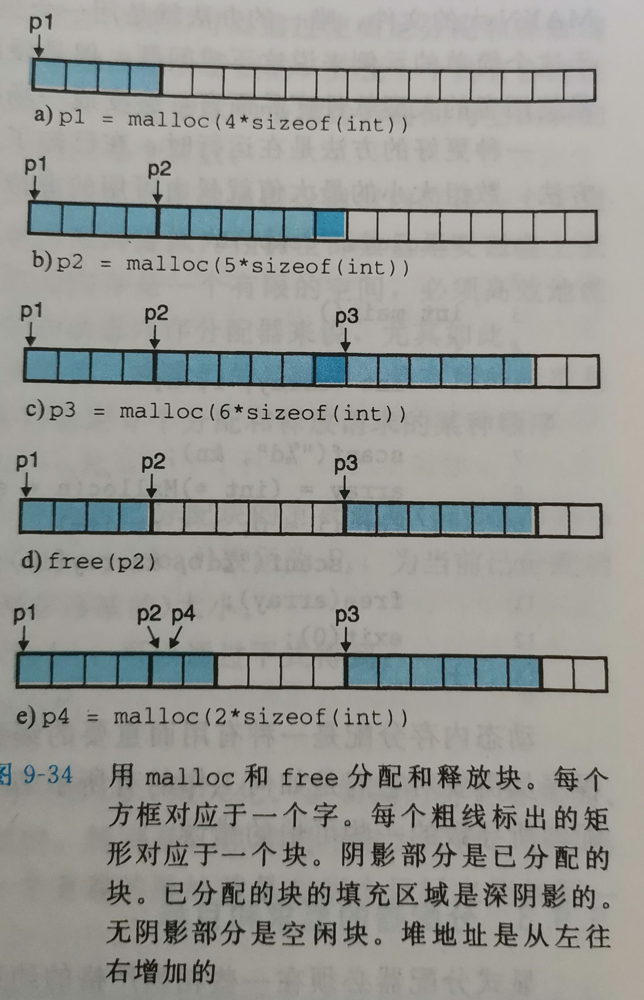

    - a：程序请求一个4字的块，malloc的响应：从空闲块的前部切出一个4字的块，并返回一个指向这个块的第一字的指针
    - b：程序请求一个5字的块，malloc的响应：从空闲块的前部分配一个6字的块，多出的一个字用于对齐
    - c：程序请求一个6字的块，malloc的响应：从空闲块的前部分配一个6字的块
    - d：程序释放在b申请单块。调用free之后，p2仍然指向被释放了的块，应用有责任在它被一个新的malloc调用重新初始化之前，不再使用p2
    - e：程序请求一个2字的块。malloc在前一步释放的空闲块中切了2个字，并返回一个指向这个新块的指针
#### 9.9.3 分配器的要求和目标
- 显式分配器的约束条件：
    - 处理任意请求序列：
        - 一个应用可以有任意的分配请求和释放请求序列，只要满足约束条件：每个释放请求都必须对应于一个当前已分配块，这个块是由一个以前的分配请求获得的。因此，分配器不可以假设分配和释放请求的顺序，例如，分配器不能假设所有的分配请求都有相匹配的释放请求，或者由相匹配的分配和空闲请求是嵌套的
    - 立即响应请求：
        - 分配器必须立即响应分配请求。因此，不允许分配器为了提高性能重新排列或者缓冲请求
    - 只使用堆：
        - 为了使分配器是可扩展的，分配器使用的任何非张量数据结构都必须保存在堆里
    - 对齐块（对齐要求）：
        - 分配器必须对齐块，使得它们可以保存任何类型的数据对象
    - 不修改已分配块：
        - 分配器只能操作或者改变空闲块。特别是，一旦快被分配了，就不允许修改或者移动它了。因此，诸如压缩已分配块这样的技术是不允许使用的
    - 限制条件下，分配器的编写者试图实现吞吐率最大化和内存使用率最大化，而这两个性能目标通常是相互冲突的
        - 目标1：最大化吞吐率。吞吐率定义为每个单位时间里完成的请求数。一个分配器一秒内可以完成500个分配请求和500个释放请求，则吞吐率为1000次/秒。通常可以使满足分配和释放请求的平均时间最小化来使吞吐率最大化。开发一个合理性的分配器并不困难
            - 合理性：一个分配请求的最糟运行时间与空闲块的数量成线性关系，而一个释放请求的运行时间是个常数
        - 目标2：最大化内存利用率。一个系统中被所有进程分配的虚拟内存的全部数量是受磁盘上交换空间的数量限制的。通常用峰值利用率来表示
#### 9.9.4 碎片
- 造成堆利用率很低的主要原因是一种称为碎片（fragmentation）的现象，当虽然有未使用的内存但不能用来满足分配请求时，就发生这种现象。有两种形式的碎片：内部碎片（internal fragmentation）和外部碎片（external fragmentation）
    - 内部碎片：发生在一个已分配块比有效载荷大时。
    - 外部碎片：当空闲内存合计起来足够满足一个分配请求，但是没有一个单独的空闲块足够大到可以来处理这个请求时发生的
#### 9.9.5 实现问题
- 考虑的问题：
    - 空闲块：如何记录空闲块？
    - 放置：如何选择一个合适的空闲块来放置一个新分配的块
    - 分割：再讲一个新分配的块放置到某个空闲块之后，如何处理这个空闲块中的剩余部分？
    - 合并：如何处理一个刚刚被释放的块？
#### 9.9.6 隐式空闲链表
- 任何实际的分配器都需要一些数据结构，允许它来区别块边界，以及区别已分配块和空闲块。大多数分配器将这些信息嵌入块本身，一个简单的方法如下图。此时，一个块是由一个字的头部、有效载荷，以及可能的一些额外的填充组成的。头部编码里这个快的大小（包括头部和所有填充），以及这个块是已分配的还是空闲的。如果强加一个双字的对齐约束，则块的大小就总是8的倍数，且块大小的最低3位总是零，因此我们只需要内存大小的29个高位，释放剩余的3位来编码其他信息：
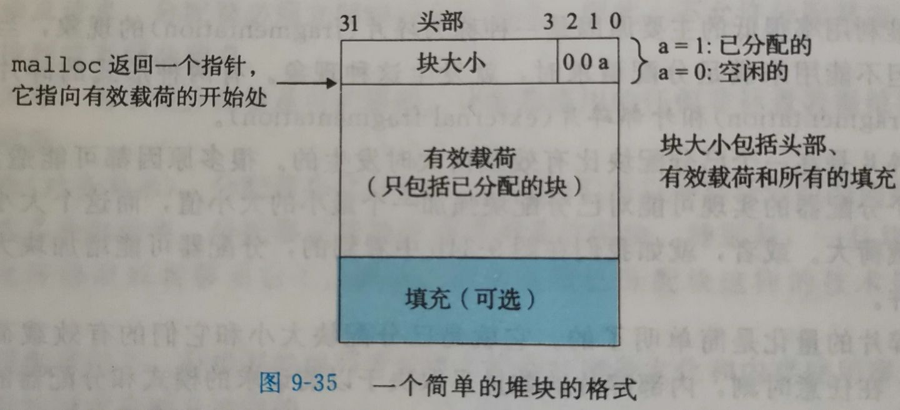
- eg，假设我们有一个已分配的块，大小为24（0x18）字节，那么它的头部将是：

`0x00000018 | 0x1 = 0x00000019`
- 假设我们有一个空闲的块，大小为40（0x28）字节，那么它的头部将是：

`0x00000028 | 0x0 = 0x00000028`

- 头部后面的就是应用调用malloc时请求的有效载荷。有效载荷后面是一片不使用的填充块，其大小可以是任意的，需要填充有很多原因，比如，填充用来对付外部碎片，或者用来满足对齐要求


- 隐式空闲链表：
    - 上面这种结构就是隐式空闲链表，因为空闲块是通过头部中的大小字段隐含地连接着的，分配器可以通过遍历堆中所有的块，从而间接地遍历整个空闲块的集合。注意，我们需要某种特殊标记的结束块，在这个示例中，就是一个设置了分配位而大小为零的终止头部。
    - 优点：简单
    - 缺点：任何操作的开销，都要对整个链表进行搜索，搜索所需时间和堆中已分配块和空闲块的总数呈线性关系。

#### 9.9.7 放置已分配的块
- 当一个应用请求一个k字节的块时，分配器搜索空闲链表，查找一个足够大可以放置所请求块的空闲块。分配器执行这种搜索的方式是由放置策略确定的。一些常见的策略是首次适配（first fit）、下一次适配（next fit）和最佳适配（best fit）
    - 首次适配从头开始搜索空闲链表，选择第一个合适的空闲块。
        - 优点：趋向于将大的空闲块保留在链表的后面；
        - 缺点：趋向于在靠近链表起始处留下小空闲块的“碎片”，这就增加了对较大块的搜索时间
    - 下一次适配：
    - 和首次适配很相似，只不过不是从链表的起始处开始每次搜索，而是从上一次查询结束的地方开始。基于这样的想法：如果我们上一次在某个空闲块里已经发现了一个匹配，那么很可能下一次我们也能在这个剩余块中发现匹配。下一次适配比首次适配运行起来明显快一些，尤其是当链表的前面布满了许多小的碎片时。但是下一次适配的内存利用率要比首次适配低
    - 最佳适配：检查每个空闲块，选择适合所需请求大小的最小空闲块。最佳适配比另外两种的内存利用率高。其缺点是：要求对堆进行彻底的搜索
#### 9.9.8 分割空闲块
- 找到匹配的空闲块之后，要确定分配空闲块的空间有多少要被使用。一个选择是使用整个空闲块，缺点是会造成内部碎片


#### 9.9.9 获取额外的堆内存
- 当分配器不能为请求块找到合适的空闲块时：
    - 选择一：通过合并那些在内存中物理上相邻的空闲块来创建一些更大的空闲块
    - 选择二：当选择一无效时（不能生成足够大的块，或者空闲块已经合并了仍然不够），分配器通过调用sbrk函数，向内核请求额外的堆内存。分配器将额外的内存转化成一个大的空闲块，将这个块插入到空闲链表中，然后将被请求的块放置在这个新的空闲块中
#### 9.9.10 合并空闲块
- 假碎片（fault fragmentation）：当分配器释放一个已分配块时，可能有其他空闲块与这个新释放的空闲块相邻，产生了有许多可用的空闲块被切割成为小的、无法使用的空闲块。如下图，每个空闲块的有效载荷是3个字，分配4个字就会出错


- 合并策略
    - 立即合并：在每次一个块被释放时，就合并所有的相邻块，优点是简单明了，可以在常数时间内执行完成，但是对于某些请求模式，这种方法会产生抖动，如上图，申请和释放3字的块，就会反复抖动
    - 推迟合并：直到某个分配请求失败，才会扫描整个堆，合并所有的空闲块
#### 9.9.11 带边界标记的合并
- 合并方法：
    - 想要释放的块为当前块。当前块的头部指向下一个块的头部，可以检查这个指针以判断下一个块是否是空闲的。如果是，就将它的大小简单地加到当前块头部的大小上，这两个块在常数时间内被合并。
    - 合并前面的块：给定一个带头部的隐式空闲链表，唯一的选择将是搜索整个链表，记住前面块的位置，直到我们到达当前块。使用隐式空闲链表，意味着每次调用free需要的事件都与堆的大小成线性关系。
    - 边界标记：一种允许在常数时间内进行对前面块合并的方法。在每个块的结尾处添加一个脚部（footer，边界标记），其中脚部就是头部的一个副本。如果每个块包括这样一个脚部，那么分配器就可以通过检查它的脚部，判断前面一个块的起始位置和状态，这个脚部总是距当前块开始位置一个字的距离


- 分配器释放当前块的所有可能存在情况：
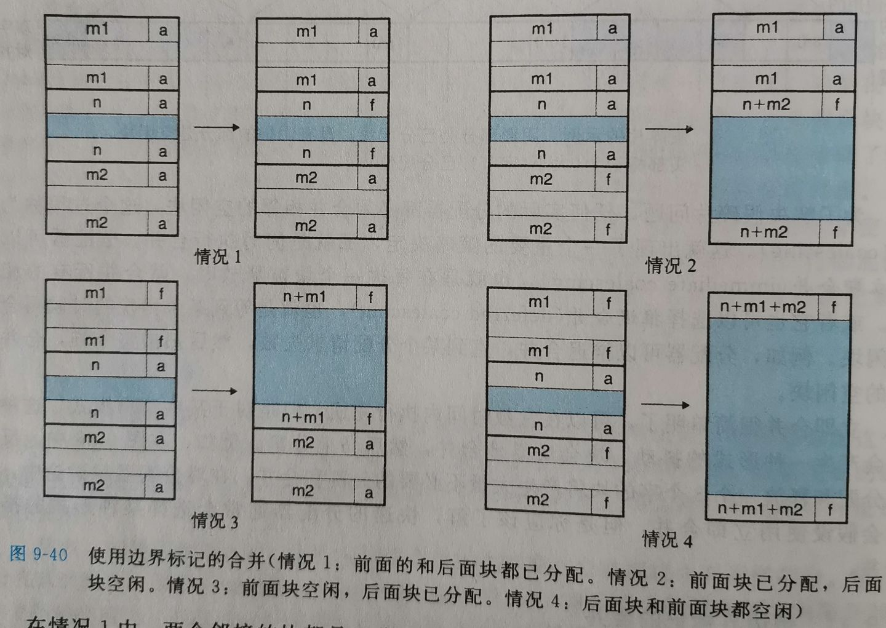
    - 1）前面的块和后面的块都是已分配的
        - 两个邻接的块都是已分配的，因此不可能合并，所以当前块的状态只是简单地从已分配变成空间
    - 2）前面的块是已分配的，后面的块是空闲的
        - 当前块与后面的块合并，用当前块和后面块的大小的和来更新当前块的头部和后面块的脚部
    - 3）前面的块是空闲的，而后面的块是已分配的
        - 前面的块和当前块合并，用两个块大小的和来更新前面块的头部和当前块的脚部
    - 4）前面的块和后面的块都是空闲的
        - 用三个块的大小的和来更新前面块的头部和后面块的脚部
- 边界标记优化：
    - 缺陷：
        - 要求每个块都保持一个头部和一个脚部，在应用程序操作许多个小块时，会产生显著的内存开销
    - 优化：
        - 把前面块的已分配/空闲位存放在当前块多出来的低位中，那么已分配块就不需要脚部了。但是 空闲块仍然需要脚部
#### 9.9.12 综合：实现一个简单的分配器
- 1.通用分配器设计

    - 如上图，mem_init函数将对于堆来说可用的虚拟内存化为一个大的、双字对齐的字节数组。在mem_heap和mem_brk之间的字节表示已分配的虚拟内存。mem_brk之后的字节表示未分配的虚拟内存。分配器通过调用mem_sbrk函数来请求额外的堆内存，这个函数和系统的sbrk函数的接口相同，而且语义也相同，除了它会拒绝收缩堆的请求
        ```
        extern int mm_init(void);
        extern void *mm_malloc(size_t size)
        extern void mm_free(void *ptr)
        ```
    - 分配器包含在一个源文件中（mm.c），分配器输出三个函数到应用：
        - mm_init：初始化分配器，如果成功就返回0，否则就返回-1
        - mm_malloc & mm_free：和对应函数有相同的接口和语义
        - 分配器使用图9-39的块格式，最小块的大小为16字节
        - 空闲链表组织成为一个隐式空闲链表，如下图所示：

    - 具体来看，第一个字是一个双字边界对齐的不使用的填充字。填充后面紧跟着一个特殊的序言块（prologue block），这是一个8字节的已分配块，只由一个头部和一个脚部组成。序言块是在初始化时创建的，并且永不释放。在序言块后紧跟的是零个或者多个由malloc或者free调用创建的普通块。堆总是以一个特殊的结尾块（epilogue block）来结束，这个块是一个大小为零的已分配块，只由一个头部组成。序言块和结尾块是一种消除合并时边界条件的技巧。分配器使用一个单独的私有（static）全局变量（heap_listp）,它总是指向序言块（作为一个小优化，可以让它指向下一个块，而不是这个序言块）

- 2.操作空闲链表的基本常数和宏
    - 展示了基本常数和宏，第2~4行定义了一些基本的大小常数：字的大小（WSIZE）和双字的大小（DSIZE），初始空闲块的大小和扩展堆时的默认大小（CHUNKSIZE）
        ```
        /* single word (4) or double word (8) alignment */
        #define ALIGNMENT 8

        /* rounds up to the nearest multiple of ALIGNMENT */
        #define ALIGN(size) (((size) + (ALIGNMENT-1)) & ~0x7)


        #define SIZE_T_SIZE (ALIGN(sizeof(size_t)))

        /* 头部/脚部的大小, 单字 */
        #define WSIZE (4)

        /* 双字大小 */
        #define DSIZE (8)

        /* 扩展堆时的默认大小 4kb */
        #define CHUNKSIZE (1 << 12)

        /* 最小申请内存大小 */
        #define MINBLOCK (DSIZE + 2 * WSIZE)

        #define MAX(x, y) ((x) > (y)? (x) : (y))

        /* 设置头部/脚部, 将size和allocate bit 合并成一个字*/
        #define PACK(size, alloc) ((size)|(alloc))

        /* 读地址p处的一个字 */
        #define GET(p) (*(unsigned int *)(p))

        /* 向地址p处写一个字 */
        #define PUT(p, val)  (*(unsigned int *)(p) = (val))

        /* 得到地址p处的size */
        #define GET_SIZE(p) (GET(p) & ~0x7)

        /* 得到地址p处的标志位 */
        #define GET_ALLOC(p) (*(p) & 0x1)

        /* 获得头部地址 */
        #define HDRP(bp) ((char*)(bp) - WSIZE)

        /* 获得脚部地址 */
        #define FTRP(bp) ((char*)bp + GET_SIZE(HDRP(bp)) - DSIZE)

        /* 计算后块的地址 */
        #define NEXT_BLKP(bp) ((char*)bp + GET_SIZE(HDRP(bp)))

        /* 计算前块的地址 */
        #define PREV_BLKP(bp) ((char*)bp - GET_SIZE((char*)(bp) - DSIZE))

        /* 指向序言块 */
        static void* heap_listp;

        /* 拓展块 */
        static void *extend_heap(size_t size);

        /* 寻找空闲块 */
        static void *find_fit(size_t size);

        /* 分割空闲块 */
        static void place(char *bp, size_t asize);

        /* 合并空闲块 */
        static void *coalesce(void *bp);
        ```
    - 空闲链表中操作头部和脚部可能是很麻烦，因为它要求大量使用强制类型转换和指针运算。因此定义了一组宏来访问和遍历空闲链表：
        - PACK宏：将大小和已分配位结合起来并返回一个值，可以把它放在头部或者脚部
        - GET宏：读取和返回参数p引用的字
        - PUT宏：将val存放在参数p指向的字中
        - GET_SIZE和GET_ALLOC：从地址p处的头部或者脚部分别返回大小和已分配位。
        - HDRP和FTRP：给定一个块指针bp，分别返回指向这个块的头部和脚部的指针
        - NEXT_BLKP和PREV_BLKP：分别返回指向后面的块和前面的块的块指针
- 3. 创建初始空闲链表：


    - 在调用mm_malloc或者mm_free之前，应用必须通过调用mm_init函数来初始化堆。mm_init函数从内存系统得到4个字，并将它们初始化，创建一个空的空闲链表（4~10）。然后它调用extend_heap函数，这函数将堆扩展CHUNKSIZE字节，并且创建初始的空闲块。此刻，分配已初始化了，并且准备好接受来自应用的分配和释放请求
    - extend函数会在两种不同环境下调用：
        - 1）当堆被初始化时
        - 2）当mm_malloc不能找到一个合适的匹配块时，为了保持对其，extend_heap将请求大小向上舍入为最接近的2字（8字节）的倍数，然后向内存系统请求额外的堆空间（7-9行）
    - extend_heap函数的剩余部分（12~17行）：堆开始于一个双字对齐的边界，并且每次extend_heap的调用都返回一个块，该块的大小为双字的整数倍。因此，对mem_sbrk的调用都返回一个双字对齐的内存片，紧跟在结尾块的头部后面。这个头部变成了新的空闲块的头部（12行），并且这个片的最后一个字变成了新的结尾块的头部（14行）。最后，在很可能出现的前一个堆以一个空闲块结束的情况中，调用coalesce函数来合并两个空闲块，并返回指向合并后的块的块指针（17行）
- 4. 释放和合并块

    - 应用通过调用mm_free函数，来释放一个以前分配的块，这个函数释放所请求的块（bp），然后使用边界标记合并技术将之与邻接的空闲块合并起来

- 5. 分配块
    - 一个应用通过调用mm_malloc函数来向内存大小为size字节的块。在检查问请求的真假之后，分配器必须调整块的大小，从而为头部和脚部留有空间，并满足双字对齐的要求。12~13行强制了最小块的大小是16字节：8字节用来满足对齐要求，而另外8字节用来放头部和脚部。对于超过8字节的请求（15行），一般的规则是加上开销字节，然后向上舍入到最接近的8的倍数
    - 一旦分配器调整了请求的大小，它就会搜索空闲链表，需找一个合适的空闲块（18行），如果有合适的，那么分配器就放置这个请求块，并可选地分割出多余的部分（19行），然后返回新分配块的地址
    - 如果分配器不能够发现一个匹配的块，那额就用一个新的空闲块来扩展堆（25~26行），把请求块放置在这个新的空闲块里，可选地分割这个块（27行），然后返回一个指向这个新分配的块的指针

#### 9.10 malloclab：
参考代码，实现了隐式空闲链表+first_fit、隐式空闲链表+next_fit、显式空闲链表+first_fit:

- 隐式空闲链表+first_fit:

    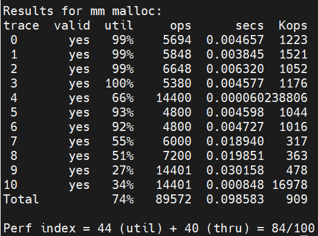

- 隐式空闲链表+next_fit:

    

- 显式空闲链表+first_fit:

    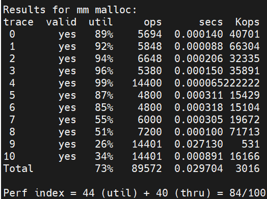

- 作业已上传：
    - https://github.com/liuxubit/csapp_labs/tree/main/malloclab

## 参考资料：
- csapp
- https://zhuanlan.zhihu.com/p/457373110

